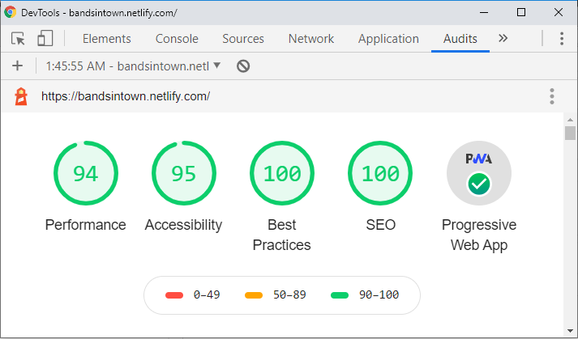

This application is hosted on Netlify at [https://bandsintown.netlify.com/](https://bandsintown.netlify.com/)
## BANDSINTOWN

This project is built using:
1. Git Repository
2. SPA with Create-react-app
3. Styling with Material-ui 
4. Responsive Web Design
5. React Hooks
6. Context API
7. Session Storage
8. Progressive Web Application
9. Unit Tests with Jest
10. Netlify for CI/CD

### `Source Directory Structure (Src)`
**src** has 5 directories 
1. **api** - contains App ID, Base URL and async funtions to api's
2. **components** - contains all components, has 4 main sub directories
    1. **app** - contains app component
    2. **artistEvent** - contains *Artist's Event* related components. Component ends with Page.js is the mail component in the directory.
    3. **common** - common contains common/reusable components e.g. spinner, tooltip, top bar in header etc.
    4. **searchArtists** - contains components related to search artist.
3. **context** - contains application's initial state, reducer and context provider.
4. **helpers** - contains helper methods that can be utilized anywhere in the application.
5. **resources** - contains static resources like theme, images, css, fonts etc.

### Git Repository

Project is setup on a public repository. The url to clone is [https://github.com/tauqeerabbas87/bit.git](https://github.com/tauqeerabbas87/bit.git)
It has two branches, **master**, **dev**. Master is the main branch that is actually deployed on the server. And Dev is the development branch.

If you want to run application locally, clone the application from above url and in the console run 
#### `yarn start` 
It will run the app in the development mode. Open [http://localhost:3000](http://localhost:3000) to view it in the browser.
The page will reload if you make edits. You will also see any lint errors in the console.

### SPA with Create-react-app

I choose react, as I have experience of more than two years in working in it.

### Styling with Material-ui

[Material-ui](https://material-ui.com/) is one of the most popular UI library with built-in collection of components. 

### Responsive Web Design

This application is fully responsive.

### React Hooks & Context API

I choose to develop using React Hooks and Context API as I have not worked on it yet. So, by making this application, I have also added new skills to my toolkit.

### Session Storage (Cache Last API results)

Session storage is used for storing compete state of the application, so that it can be cached for last APIs.

Secondly, it should also maintain the state with last data, if user refreshes the page. I have used Session Storage over local storage, because the api's response can be updated over time. Their is a less probability that events data is updated for last api in for the current session. As the data removes when the tab is closed in session storage.

### Progressive Web Application

This application can be installed/Displayed as app on the following
 1. Desktop chrome browser's app section
 2. Android home screen (as an app)
 3. IOS home screen (as an app)
 
 The pages that have been visited will be cached, the static resources will be cached, the last API calls are already being cached. So, if a user has visited some pages and her internet is disconnected, user will still be able to navigate and view the last results.

I have performed the chrome audit for mobile and the result are satisfactory.

### Unit Tests with Jest

### Netlify for CI/CD

This application is hosted on Netlify. Whenever a pull request will be successfully merged into **master** branch at Git, auto deployment process on Netlify will start.
 
 First it will create a build from src folder and then deploy the build folder on the hosting site.
 
 The complete log for success/failure will be displayed in the deployment section on Netlify user panel.
